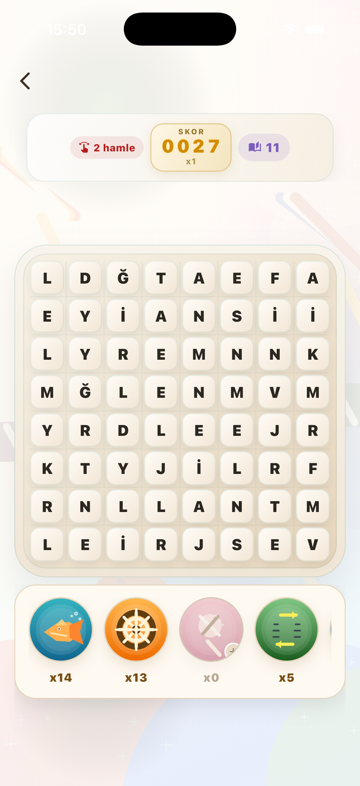
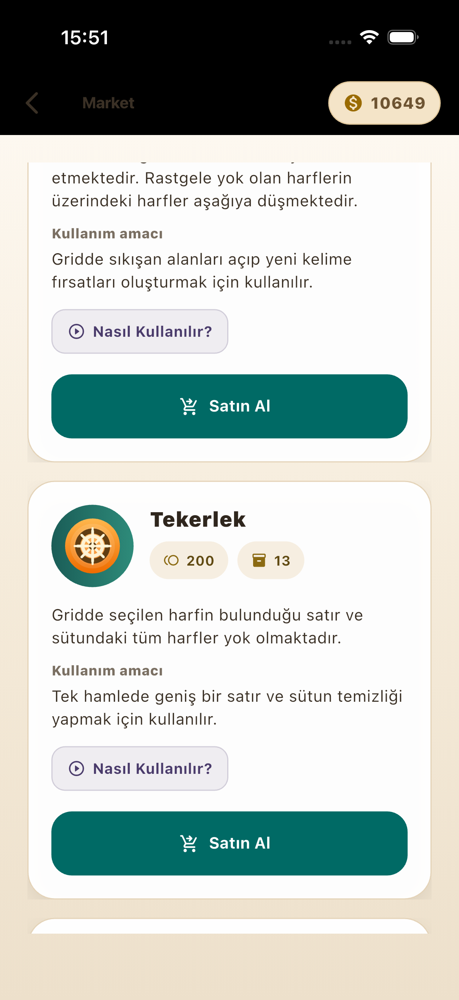
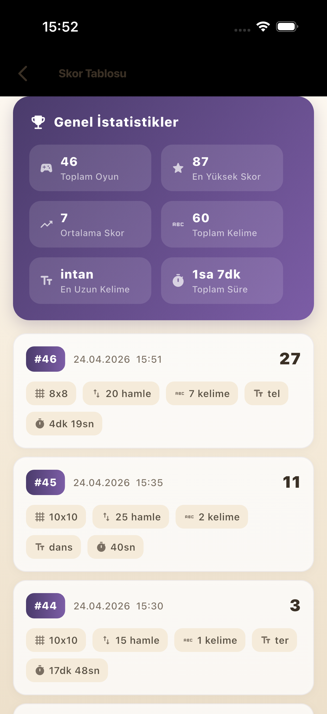

<div align="center">

# Crush Word

**Flutter ile geliştirilmiş tek oyunculu Türkçe kelime bulma oyunu**

Kare harf ızgarasında komşu harfleri sürükle, anlamlı Türkçe kelimeler oluştur, puan kazan.  
Tamamen çevrimdışı çalışır — sunucu bağımlılığı yok.

[](https://flutter.dev)
[](https://dart.dev)
[](LICENSE)

**[IEEE Teknik Raporu](report/main.pdf)**

</div>

---

## Ekran Görüntüleri

<p align="center">
  
  &nbsp;&nbsp;
  
  &nbsp;&nbsp;
  
</p>
<p align="center">
  <em>Oyun ekranı &nbsp;&nbsp;&nbsp;&nbsp;&nbsp;&nbsp;&nbsp;&nbsp;&nbsp;&nbsp;&nbsp;&nbsp;&nbsp;&nbsp;&nbsp;&nbsp;&nbsp;&nbsp;&nbsp;&nbsp;&nbsp;&nbsp;&nbsp;&nbsp; Market &nbsp;&nbsp;&nbsp;&nbsp;&nbsp;&nbsp;&nbsp;&nbsp;&nbsp;&nbsp;&nbsp;&nbsp;&nbsp;&nbsp;&nbsp;&nbsp;&nbsp;&nbsp;&nbsp;&nbsp;&nbsp;&nbsp;&nbsp;&nbsp;&nbsp;&nbsp;&nbsp;&nbsp; Skor Tablosu</em>
</p>

---

## Nasıl Oynanır?

1. Grid boyutunu seç: **6×6** (Zor) · **8×8** (Orta) · **10×10** (Kolay)
2. Hamle limitini seç: **15 · 20 · 25**
3. Tahtada komşu harfleri 8 yönde sürükleyerek kelime oluştur (en az 3 harf)
4. Geçerli kelimeler temizlenir, harfler aşağı düşer, boşluklar yeni harflerle dolar
5. Hamle bitmeden en yüksek puanı topla

---

## Temel Mekanikler

### Ağırlıklı Harf Üretimi

Tahta, Türkçe harf frekanslarına göre üç kademeli ağırlıklı algoritmayla oluşturulur:

| Kademe | Ağırlık | Harfler |
|--------|---------|---------|
| Yüksek frekans | 6 | A, E, İ, L, R, N |
| Orta frekans | 3 | K, M, T, S, Y, D |
| Düşük frekans | 1 | J, Ğ, F, V |

### Oynanabilir Tahta Garantisi

Her hamle sonrası tahta, **Trie + DFS + backtracking** algoritmasıyla analiz edilir. Geçerli kelime bulunamazsa iki aşamalı kurtarma devreye girer:

1. **Fisher-Yates karıştırma** (maks. 5 deneme) — mevcut harfleri yeniden düzenler
2. **Yeniden üretim** (maks. 10 deneme) — tamamen yeni tahta oluşturur

Oyuncuya hiçbir zaman çıkmaz tahta gösterilmez.

### Puanlama

Her harf, Türkçe'deki kullanım sıklığına göre puan taşır:

| Puan | Harfler |
|------|---------|
| 1 | A, E, İ, K, L, N, R, T |
| 2 | I, M, O, S, U |
| 3 | B, D, Ü, Y |
| 4 | C, Ç, Ş, Z |
| 5 | G, H, P |
| 7 | F, Ö, V |
| 8 | Ğ |
| 10 | J |

### Combo Puanlama

Ana kelimenin içindeki geçerli bitişik alt kelimeler de puan kazandırır.  
Örnek: **YAZAR** → YAZ + AZAR + YAZAR = 3 combo, üç kelimenin puanı birden.

### Power Tile Sistemi

Uzun kelimeler son harfin konumuna özel güç bırakır. Bu güç başka bir kelimede kullanıldığında aktif olur:

| Kelime Uzunluğu | Etki |
|-----------------|------|
| 4 harf | Satır temizleme |
| 5 harf | Alan patlatma |
| 6 harf | Sütun temizleme |
| 7+ harf | Mega patlatma |

---

## Market & Joker Sistemi

Oyun içi altınla joker satın alınır; gerçek para işlemi yoktur.

| Joker | İşlev | Maliyet |
|-------|-------|---------|
| Balık | Rastgele harf yok eder | 100 altın |
| Tekerlek | Seçilen harfin satır ve sütununu temizler | 200 altın |
| Lolipop Kırıcı | Tek harf kaldırır | 75 altın |
| Serbest Değiştirme | Komşu iki harfin yerini değiştirir | 125 altın |
| Harf Karıştırma | Tüm tahtayı karıştırır | 300 altın |
| Parti Güçlendiricisi | Tahtayı tamamen sıfırlar | 400 altın |

---

## Skor Geçmişi

Her oyun otomatik kaydedilir. Skor tablosunda şunlar görünür:

- **Genel istatistikler:** toplam oyun, en yüksek skor, ortalama skor, toplam kelime, en uzun kelime, toplam süre
- **Oyun detayı:** grid boyutu, hamle sayısı, bulunan kelimeler, süre

---

## Mimari

Feature-first yapı; oyun mantığı UI'dan tamamen bağımsız ve test edilebilir:

```
lib/src/
├── app/              # Bootstrap, route, navigation
├── core/
│   ├── config/       # Oyun kuralları ve runtime config
│   ├── models/       # Domain modelleri
│   ├── repositories/ # Sözlük, profil, geçmiş, cüzdan, checkpoint
│   └── storage/      # SQLite & SharedPreferences servisleri
└── features/
    ├── game/         # Oyun ekranı ve controller
    ├── game_setup/   # Tahta ve hamle seçimi
    ├── home/         # Ana ekran
    ├── market/       # Joker mağazası
    ├── onboarding/   # Kullanıcı adı akışı
    └── score_history/# Skor tablosu
```

Yerel veri: `word_crush.db` (SQLite) — oyun sonuçları, joker envanteri, cüzdan, oturum checkpoint.

---

## Teknoloji

- **Flutter / Dart** — cross-platform mobil geliştirme
- `sqflite` — yerel SQLite veritabanı
- `shared_preferences` — profil verisi
- `flutter_test` + `sqflite_common_ffi` — test altyapısı

---

## Çalıştırma

```bash
flutter pub get
flutter run
```

## Test

```bash
flutter analyze
flutter test
```

---

## Rapor

Projenin IEEE formatındaki teknik raporu `report/` klasöründe:

- **[report/main.pdf](report/main.pdf)** — Sistem mimarisi, algoritmalar, test sonuçları
- `report/main.tex` — LaTeX kaynak dosyası

---

## Geliştiren

**Enes Demir** & **Mert Şengül**

---

## Lisans

[MIT License](LICENSE)
