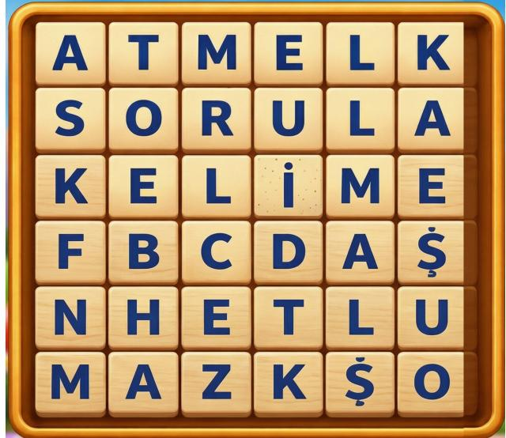
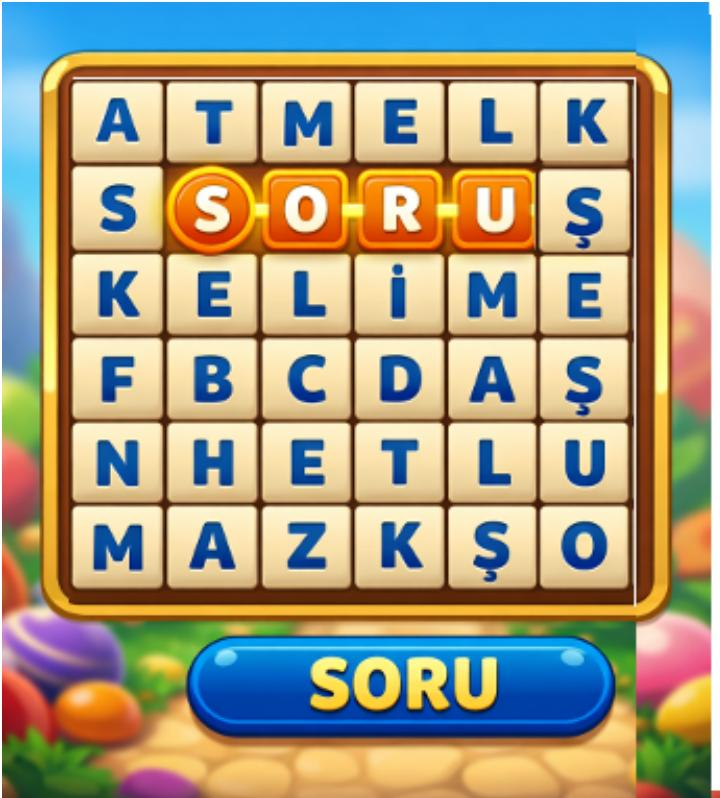
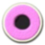
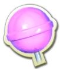
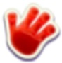
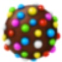

# KOCAELİ ÜNİVERSİTESİ BİLGİSAYAR MÜHENDİSLİĞİ BÖLÜMÜ YAZILIM LABORATUVARI-II

PROJE II

Word Crush Mobil Oyunu

Proje Teslim Tarihi: 01.05.2026

Bu projede mobil programlama kullanılarak kelime tabanlı bir oyun geliştirilmesi hedeflenmektedir. Oyuncu, oyun alanında bulunan harfleri kullanarak anlamlı kelimeler oluşturur. Oluşturulan kelimeler oyun alanından silinir ve yerlerine yeni harfler düşer. Oyuncu verilen hamle sayısı içerisinde en yüksek puanı elde etmeye çalışır. Bu oyunun temel amacı, oyuncunun hem kelime bilgisini hem de stratejik düşünme yeteneğini geliştirmektir.

## Amaç:

1. Mobil programlama konusunda bilgi ve beceri kazanılması

2. Mobil programlama aracılığıyla oyun geliştirme ve uygulama oluşturma becerisinin geliştirilmesi.

3. Dinamik özelliklere sahip bir program geliştirebilme

Programlama Dili: Java, Kotlin, Flutter, React Native, Swift vb.

## Mobil Programlama

1. Mobil programlama kodları Android veya IOS için geliştirilmelidir.

2. Kodlama için herhangi bir programlama dili kullanılabilir.

3. Geliştirilecek uygulama kelime tabanlı bir oyundur. Bundan dolayı oyunda kelime listesinin kullanılması gereklidir.

4. Sunum sırasında oyun gösterimi emulatör veya telefon üzerinde gerçekleştirilecektir. Web veya masaüstü gösterimler kabul edilmeyecektir.

## Uygulama Yapısı

Oyun, iki boyutlu bir grid yapısından oluşmaktadır. Bu grid, satır ve sütunlardan meydana gelen kare bir yapıdadır. Her kare içerisinde bir harf bulunmaktadır. Oyuncu bu harfleri kullanarak kelime oluşturacaktır.

## Oyun Giriş Ekranı ve Seçenekler

Oyun ilk açıldığında oyuncudan kullanıcı adı girmesi istenecektir. Kullanıcı adı girdikten sonra oyuncu ana ekrana yönlendirilir. Kullanıcı adı ilk girişte alınır ve daha sonra kullanılmak üzere saklanır. Kullanıcı uygulamayı tekrar açtığında yeniden isim girmesine gerek kalmayacaktır. Değişiklik durumlarında ana ekranın sol üst kısımda yer alan kullanıcı isminin üzerine tıklayarak değiştirilecektir.

## Ana Ekran Tasarımı

Ana ekran, kullanıcının oyun ile ilgili tüm işlemleri gerçekleştirebileceği merkez ekran olacaktır. Bu ekranın orta kısmında aşağıdaki seçenekler bulunacaktır:

● Yeni Oyun

Skor Tablosu

● Market

## Yeni Oyun

Kullanıcı "Yeni Oyun" butonuna tıklandığında oyun ayarlarının seçileceği ekran açılır.

Bu ekranda kullanıcıya grid boyutu seçenekleri sunulur:

6x6 Grid (Zor Seviye)

8x8 Grid (Orta Seviye)

10x10 Grid (Kolay Seviye)

Kullanıcı grid boyutunu seçtikten sonra Hamle sayısını seçim ekranına yönlendirecektir. Açılan ekranda

Kolay level → 25 hamle

● Orta level → 20 hamle

Zor level → 15 hamle

Hamle sayısını seçecektir ve oyun başlayacaktır. Oyuncu her kelime oluşturduğunda bir hamle harcamış olur. (Hatalı kelimede olsa)

## Skor Tablosu

Skor tablosunda, kendi performansını takip etmesini amaçlamaktadır. Skor tablosu, oyuncunun oynadığı oyunların geçmişini inceleyebileceği ve gelişimini gözlemleyebileceği bir yapı sunacaktır.

Ana ekranda bulunan "Skor Tablosu" butonuna tıklandığında kullanıcının geçmiş oyunların listelendiği bir ekran açılacaktır.

Skor tablosu ekranının üst kısmında kullanıcının genel performansını gösteren bir özet alanı bulunacaktır. Bu alanda aşağıdaki bilgiler yer alacaktır:

Toplam Oynanan Oyun Sayısı

En Yüksek Puan

● Ortalama Puan

Toplam Bulunan Kelime Sayısı

En Uzun Kelime

Toplam Oyun Süresi

Örnek:

Toplam Oyun: 12   
En Yüksek Puan: 1450   
Ortalama Puan: 860   
Toplam Kelime: 132   
En Uzun Kelime: "KELİMELER"   
Toplam Süre: 1 saat 25 dakika

Bu alan kullanıcının genel performansını hızlı şekilde görebilmesini sağlar.

Skor ekranının alt kısmında kullanıcının oynadığı tüm oyunlar liste halinde gösterilecektir. Bu liste en son oynanan oyun üstte olacak şekilde sıralanacaktır.

Her oyun kartında aşağıdaki bilgiler yer alacaktır:

Oyun numarası

● Oyun tarihi

Grid boyutu (6x6 / 8x8 / 10x10)

Toplam puan

Bulunan kelime sayısı

En uzun kelime

Oyun süresi

Örnek Oyun Kartı:

Oyun 12   
Tarih: 15.05.2026   
Grid: 8x8   
Puan: 1240   
Kelime Sayısı: 18   
En Uzun Kelime: "KELİMELER"   
Süre: 6 dk

Bu yapı sayesinde kullanıcı geçmiş performanslarını detaylı şekilde inceleyebilecektir.

## Market

Bu bölümde, oyun içerisinde kullanılabilecek joker özelliklerinin satın alınması işlemleri gerçekleştirilecektir. Kullanıcılar, oyun sırasında avantaj sağlayan çeşitli jokerleri oyun içi altın kullanarak satın alabileceklerdir.

Oyun içerisinde, kullanıcıya başlangıçta belirli miktarda oyun içi altın tanımlanacaktır. Bu altınlar, yalnızca oyun içi özellikleri satın almak amacıyla kullanılacaktır. Kullanıcı, sahip olduğu altın miktarını joker satın alma ekranında görüntüleyebilecektir.

Joker satın alma ekranında, her jokerin:

● Özellik açıklaması

Kullanım amacı

● Altın maliyeti

Kullanım şekli (Animasyonlu gösterim yapılabilir)

bilgileri açık bir şekilde gösterilecektir. Kullanıcı, yeterli altına sahipse istediği jokeri satın alabilecek ve oyun sırasında bu jokerleri kullanabilecektir.

Bu projede gerçek para ile altın satın alma sistemi bulunmayacaktır. Bu nedenle kullanıcıya, test ve oyun deneyiminin kesintisiz devam edebilmesi amacıyla başlangıçta sınırsız veya yüksek miktarda altın tanımlanacaktır. Böylece kullanıcı, oyun içindeki tüm joker özelliklerini rahatlıkla deneyebilecektir.

## Oyun Ekranı ve Oyun Oynama Adımları

Grid seviyelerinden biri seçildikten sonra oyun ekranı geçilecektir. Bu ekranda seçilen grid değeri göre harf alanı açılacaktır. Örneğin 6x6 seçimin gösterimi aşağıdaki gibidir.

Burada harfler rastgele bir şekilde atanmaktadır. Fakat rastgele atanırken kelime oluşturması için belirli bir şekilde bu rastgeleliği sağlanması gereklidir. Eğer tamamen rastgele harf üretilirse, anlamlı kelime oluşturmak zorlaşır. Bu nedenle harfler Türkçe diline uygun frekanslara göre üretilir.

Örneğin Türkçede en sık kullanılan harfler:

A

E

İ

L

R

N

Bu harflerin gelme olasılığı daha yüksek tutulur.

Orta sıklıkta kullanılan harfler:

K

M

T

S

Y

D

Bu harfler orta seviyede üretilecektir.

Daha az kullanılan harfler:

J

Ğ

F

V

Bu harflerin gelme olasılığı daha düşük tutulur.

Bu kurallara göre harfler rastgele dağıtacak şekilde bir algoritma geliştirecektir. Bu algoritmayı geliştirirken harflerden oluşabilecek kelimeler kontrol edilecektir. Kelimelerin kontrolü yapılarak algoritma geliştirilmesi beklenmektedir.

## 4.1 Başlangıç Harfi Seçimi

Oyuncu kelime oluşturmak için grid üzerinde bulunan herhangi bir harfi seçerek başlar. Oyuncu harfin üzerine dokunduğunda, seçilen harf görsel olarak vurgulanır. Bu vurgulama, oyuncunun hangi harfi seçtiğini anlamasını sağlar. Seçilen ilk harf, oluşturulacak kelimenin başlangıç harfi olarak kabul edilir.

Oyuncu ilk harfi seçtikten sonra parmağını sürükleyerek komşu harfleri seçmeye devam eder.   
Ancak burada önemli bir kural vardır. Oyuncu sadece komşu harflere geçebilir.

Komşuluk şu yönleri kapsar:

● Yukarı

● Aşağı

Sağ

● Sol

Sağ üst

Sağ alt

● Sol üst

● Sol alt

Bu sayede oyuncu toplam 8 farklı yönde hareket edebilir.

Bu sistem oyuncuya daha fazla kelime oluşturma özgürlüğü sağlar.

Oyuncu harfleri seçerken her yeni seçilen harf bir önceki harfe komşu olmak zorundadır. Ayrıca seçilen harf tekrar seçilemez. Bu kural, aynı hücrenin bir kelime içerisinde birden fazla kullanılmasını engeller. Örnek:

Oyunda oluşturulabilecek kelimelerin minimum uzunluğu 3 harf olarak belirlenmiştir. Oyuncu 3 harften kısa bir seçim yaptığında bu seçim geçersiz sayılır.

## 5. Kelime Doğrulama Mekaniği

Oyuncu parmağını ekrandan kaldırdığında kelime oluşturma işlemi tamamlanmış olur. Seçilen harfler birleştirilerek kelime elde edilir. Daha sonra bu kelime sözlük veri tabanında kontrol edilir.

Eğer kelime sözlükte bulunuyorsa:

Kelime geçerli kabul edilir

Harfler patlatılır

Eğer kelime sözlükte bulunmuyorsa:

Seçim iptal edilir

Harfler eski haline döner

Her iki durumda da hamle sayısı 1 değer düşmektedir.

Yok olan kelimenin puanı hesaplanarak üst kısmında anlık puan kısmına ekleme yapılır. Her harfin puanı farklıdır. Harf puanlarına göre ilgili kelimenin puanı hesaplanarak genel puana eklenmektedir.

Harflerin puanları aşağıdaki tabloda gösterilmiştir.

<table><tr><td rowspan=1 colspan=1>Harf</td><td rowspan=1 colspan=1>A</td><td rowspan=1 colspan=1></td><td rowspan=1 colspan=1>C</td><td rowspan=1 colspan=1></td><td rowspan=1 colspan=1></td><td rowspan=1 colspan=1></td><td rowspan=1 colspan=1></td><td rowspan=1 colspan=1></td><td rowspan=1 colspan=1></td><td rowspan=1 colspan=1></td><td rowspan=1 colspan=1></td><td rowspan=1 colspan=1></td><td rowspan=1 colspan=1>」</td><td rowspan=1 colspan=1>K</td><td rowspan=1 colspan=1>L</td></tr><tr><td rowspan=1 colspan=1>Puani</td><td rowspan=1 colspan=1>1</td><td rowspan=1 colspan=1>3</td><td rowspan=1 colspan=1>4</td><td rowspan=1 colspan=1>4</td><td rowspan=1 colspan=1>3</td><td rowspan=1 colspan=1>1</td><td rowspan=1 colspan=1>7</td><td rowspan=1 colspan=1>5</td><td rowspan=1 colspan=1>8</td><td rowspan=1 colspan=1>5</td><td rowspan=1 colspan=1>2</td><td rowspan=1 colspan=1>1</td><td rowspan=1 colspan=1>10</td><td rowspan=1 colspan=1>1</td><td rowspan=1 colspan=1>1</td></tr><tr><td rowspan=1 colspan=1>Harf</td><td rowspan=1 colspan=1>M</td><td rowspan=1 colspan=1>N</td><td rowspan=1 colspan=1>。</td><td rowspan=1 colspan=1></td><td rowspan=1 colspan=1></td><td rowspan=1 colspan=1></td><td rowspan=1 colspan=1></td><td rowspan=1 colspan=1></td><td rowspan=1 colspan=1></td><td rowspan=1 colspan=1></td><td rowspan=1 colspan=1>U</td><td rowspan=1 colspan=1>V</td><td rowspan=1 colspan=1>Y</td><td rowspan=1 colspan=1>Z</td><td rowspan=1 colspan=1></td></tr><tr><td rowspan=1 colspan=1>Puani</td><td rowspan=1 colspan=1>2</td><td rowspan=1 colspan=1>1</td><td rowspan=1 colspan=1>2</td><td rowspan=1 colspan=1></td><td rowspan=1 colspan=1></td><td rowspan=1 colspan=1></td><td rowspan=1 colspan=1>2</td><td rowspan=1 colspan=1>4</td><td rowspan=1 colspan=1>12</td><td rowspan=1 colspan=1>12</td><td rowspan=1 colspan=1>3</td><td rowspan=1 colspan=1>7</td><td rowspan=1 colspan=1>3</td><td rowspan=1 colspan=1>4</td><td rowspan=1 colspan=1></td></tr></table>

Örnek Puan hesaplama: “soru” kelimesinin puanı 2+2+1+2 =7 puandır.

## 6. Harf Patlatma Mekaniği

Geçerli bir kelime oluşturulduğunda, seçilen harfler oyun alanından kaldırılır. Kaldırılan harflerin üstünde bulunan harfler aşağı doğru düşer. Bu işlem yerçekimi mantığı ile gerçekleştirilir.

Boş kalan alanlara üstten yeni harfler üretilir.

Oyunda oyuncuların uzun kelimeler oluşturması teşvik edilmektedir. Oluşturulan kelimenin harf sayısına göre özel güçler oluşmaktadır. Bu özel güçler, kelime patlatıldıktan sonra son harfin bulunduğu konumda özel bir simge olarak bırakılır. Oyuncu bu simgeyi tekrar bir kelime içerisinde kullandığında ilgili özel güç aktif hale gelir.

Aşağıdaki tabloda özel güç mekanikleri detaylı olarak verilmiştir:

<table><tr><td rowspan=1 colspan=1>KelimeUzunlugu</td><td rowspan=1 colspan=1>Ozel Guc Ad1</td><td rowspan=1 colspan=1>Simge</td><td rowspan=1 colspan=1>Aciklama</td></tr><tr><td rowspan=1 colspan=1>4 harf</td><td rowspan=1 colspan=1>Satir Temizleme</td><td rowspan=1 colspan=1>A</td><td rowspan=1 colspan=1>Patlatilan son harf yerinde kalarak ozelbir simgeye donüsur. Bu harf tekrarkullanildiginda bulundugu satir tamamentemizlenir.</td></tr><tr><td rowspan=1 colspan=1>5 harf</td><td rowspan=1 colspan=1> Alan Patlatma</td><td rowspan=1 colspan=1>A米</td><td rowspan=1 colspan=1>Patlatilan son harf yerinde kalir ve bomba simgesine donüsir. Bu harf tekrarkullanildiginda cevresindeki tim komsuharfler yok edilir.</td></tr><tr><td rowspan=1 colspan=1>6 harf</td><td rowspan=1 colspan=1>Sütun Temizleme</td><td rowspan=1 colspan=1>AN</td><td rowspan=1 colspan=1>Patlatilan son harf ozel simgeye donusür. Bu harf tekrar kullanildiginda bulundugu sutun tamamen temizlenir.</td></tr><tr><td rowspan=1 colspan=1>7 harf ve üzeri</td><td rowspan=1 colspan=1>Mega Patlatma</td><td rowspan=1 colspan=1>A0</td><td rowspan=1 colspan=1>Patlatilan son harf mega simgeyedonüsir. Bu harf tekrar kullanildiginda 2birim cevresindeki tim harfler yok edilir.</td></tr></table>

## 8. Kelime Kalmama Kontrolü

Her hamle sonrasında grid üzerinde kelime kalıp kalmadığı kontrol edilir. Bu kontrol algoritmik olarak yapılır.

Grid üzerindeki her harf başlangıç noktası kabul edilir. Daha sonra komşu harfler kontrol edilerek kelime oluşturulmaya çalışılır. Oyunda grid oluşturulurken ve her hamle sonrasında arka planda çalışan bir kelime tarama algoritması bulunacaktır. Bu algoritma, grid üzerinde sözlükte geçerli ve oyun kurallarına uygun şekilde oluşturulabilecek kelimeleri tespit eder. Tespit edilen kelime sayısı oyun ekranının üst kısmında kullanıcıya gösterilecektir.

## Örnek gösterim:

## Gridde Oluşturulabilir Kelime Sayısı: 3

Bu mekanizmanın amacı, oyuncunun o anki gridin oynanabilir durumda olup olmadığını anlayabilmesini sağlamaktır. Ayrıca sistem, grid üzerinde hiç kelime kalmaması riskini önlemek amacıyla minimum kelime kontrolü yapacaktır.

Bu kapsamda aşağıdaki kurallar uygulanacaktır:

1. Oyun başlangıcında grid üretildikten hemen sonra sistem, grid üzerinde oluşturulabilecek kelimeleri analiz edecektir.

2. Eğer analiz sonucunda grid üzerinde en az 1 geçerli kelime bulunmuyorsa, grid mevcut haliyle kullanıcıya gösterilmeyecektir.

3. Bu durumda sistem, harfleri tamamen rastgele yeniden üretmek yerine kurallı harf üretimi uygulayacaktır.

4. Kurallı harf üretimi sırasında, Türkçe harf frekansları, komşuluk ilişkileri ve sözlük kontrolü dikkate alınarak grid üzerinde en az 1 anlamlı kelime oluşacak şekilde harf yerleşimi düzenlenecektir.

5. Her başarılı veya başarısız hamleden sonra grid yeniden analiz edilecek ve ekrandaki oluşturulabilir kelime sayısı güncellenecektir.

6. Yeni harflerin üstten düşmesiyle oluşan gridde de yine en az 1 geçerli kelime bulunup bulunmadığı kontrol edilecektir.

7. Eğer hamle sonrası gridde hiç kelime kalmadığı tespit edilirse, sistem otomatik olarak karıştırma, yeniden üretme veya kontrollü harf yerleştirme mekanizmalarından birini devreye alacaktır.

8. Kelime sayısı, kelimelerin ortak harf kullanamayacak şekilde oluşturulmasıyla bulunmaktadır.

9. Kelime sayısı, kelimelerin ortak harf kullanamayacak şekilde oluşturulmasıyla bulunmaktadır.

Bu sayede oyun alanının her zaman çözülebilir durumda kalması hedeflenmektedir. Böylece kullanıcı, kelime bulunamayan bir grid ile karşılaşmayacak ve oyun akışı kesintiye uğramayacaktır.

## 9. Joker Mekaniği

Oyun ekranında ayrıca markette alınan özel güçlere sahip joker elemanlar olacaktır. Bu jokerler oyun ekranın altında seçilebilir şekilde olacaktır. Marketten alındığında aktif olacak ve kullanılabilir olarak görülecektir. Jokerler ve özellikleri aşağıda listelenmiştir.

<table><tr><td rowspan=1 colspan=1>Simgesi</td><td rowspan=1 colspan=1>Ismi</td><td rowspan=1 colspan=1>Altin</td><td rowspan=1 colspan=1>Aciklamas1</td></tr><tr><td rowspan=1 colspan=1></td><td rowspan=1 colspan=1>Balik</td><td rowspan=1 colspan=1>100</td><td rowspan=1 colspan=1>Gridde rastgele olarak harfleri yoketmektedir. Rastgele yok olan harflerinüzerindeki harfler asagiya dusmektedir.</td></tr><tr><td rowspan=1 colspan=1></td><td rowspan=1 colspan=1>Tekerlek</td><td rowspan=1 colspan=1>200</td><td rowspan=1 colspan=1>Gridde secilen harfin bulundugu satirve   sutundakitumharfleryokolmaktadir.</td></tr><tr><td rowspan=1 colspan=1></td><td rowspan=1 colspan=1>Lolipop Kiric1</td><td rowspan=1 colspan=1>75</td><td rowspan=1 colspan=1>Gridde secilen bir harfi yok etmek icinkullanilmaktadir.Buharfyokoldugundayukarisindakikelimelerasagi dusmektedir.</td></tr><tr><td rowspan=1 colspan=1></td><td rowspan=1 colspan=1>SerbestDegistirme</td><td rowspan=1 colspan=1>125</td><td rowspan=1 colspan=1>Gridde birbirine temas eden iki harfinyer degistirilmesini saglamaktadir.</td></tr><tr><td rowspan=1 colspan=1></td><td rowspan=1 colspan=1>Harf Karistirma</td><td rowspan=1 colspan=1>300</td><td rowspan=1 colspan=1>Bu ozellik secildiginde gridde bulunanharflerin    rastgele   birsekildekaristirilmasini saglamaktadir.</td></tr><tr><td rowspan=1 colspan=1></td><td rowspan=1 colspan=1>PartiGuclendiricisi</td><td rowspan=1 colspan=1>400</td><td rowspan=1 colspan=1>Bu ozellik secildiginde gridde bulunantuim harfler yok edilir ve tekrardanrastgele bir sekildeharfler yukaridanasagiya dusmektedir.</td></tr></table>

## 10. Combo Mekaniği

Combo Mekaniği, oyuncunun oluşturduğu ana kelimenin içinde yer alan anlamlı alt kelimeler üzerinden puan kazanmasını sağlayan bir mekanizma olarak tasarlanmıştır. Bu mekanizma, oyuncuyu daha uzun ve stratejik kelimeler oluşturmaya teşvik etmekte, oyun deneyimini zenginleştirmektedir.

Combo oluşumu için izlenen temel kurallar şunlardır:

1. Ana Kelime Seçimi: Oyuncu, grid üzerinde anlamlı bir kelime oluşturur ve bu kelime ana kelime olarak kabul edilir.

2. Alt Kelime Tespiti: Ana kelime içinde 3 harf veya daha uzun anlamlı kelimeler aranır.

3. Combo Sayımı: Bulunan her alt kelime, combo sayısını artırır. Ana kelime her zaman combo sayısına dahildir.

4. Tekrarlama Kısıtlaması: Aynı alt kelime birden fazla kez sayılamaz.

5. Harf Sırası: Alt kelimeler, ana kelimenin harf sırasına göre bulunmalıdır.

## Örnek Combo Hesaplamaları

<table><tr><td rowspan=1 colspan=1> Ana Kelime</td><td rowspan=1 colspan=1>ic Kelimeler</td><td rowspan=1 colspan=1>Combo Sayis1</td></tr><tr><td rowspan=1 colspan=1>ADANA</td><td rowspan=1 colspan=1>ADANA,DANA,ANA,ADA</td><td rowspan=1 colspan=1>4 x combo</td></tr><tr><td rowspan=1 colspan=1>MASAL</td><td rowspan=1 colspan=1> MASAL,MASA,ASA,SAL</td><td rowspan=1 colspan=1>4 x combo</td></tr><tr><td rowspan=1 colspan=1>SARI</td><td rowspan=1 colspan=1>SARI, ARI</td><td rowspan=1 colspan=1>2 x combo</td></tr></table>

Burada combo puan hesaplanması sırasında normal harf hesaplaması gibi alt kelimelerin puanları da hesaplanarak puan hesaplaması yapılır.

Örneğin SARI kelimesi bulundu. 2+1+1+2 = 6 Puan olması gerekirken ARI kelimesinin den de puan hesaplanıp eklenmektedir. 1+1+2=4 puanda gelir toplam olarak 10 puan eklenmektedir.

## 11. Oyun Bitirme Koşulları

Oyun aşağıdaki durumlarda sona erer:

● Hamle sayısı bittiğinde oyun otomatik olarak biter ve oyun mevcut sonucu skor tablosuna yazılır ve ana ekrana geri döner.

Oyuncu geri diyerek oyundan çıkmak istediğinde “ oyuncuya çıkmak istediğinize emin misiniz” soru sorularak “Evet” ve “Hayır” seçenekleri sunulur. Hayır dediğinizde oyuna kaldığı yerden devam eder. “Evet” dediğinde ise mevcut sonucu skor tablosuna yazılır ve ana ekrana döner.

## Ödev Teslimi ve Kurallar

Proje raporu sadece LaTeX kullanılarak yazılmalı ve pdf formatında sisteme yüklenmelidir. Sisteme ayrıca LaTeX eklentileri de yüklenmelidir. Proje raporunu sadece pdf formatında yükleyen öğrencilerin proje rapor puanı 0 (sıfır) olarak değerlendirilecektir.

Proje grupları en fazla 2 kişilik olabilir.

● Her öğrenci kendi öğretim türü içerisinde grup oluşturacaktır.

● Proje raporu IEEE formatında en az 4 sayfa hazırlanmalıdır.

● Dersin takibi ve proje teslimi edestek2.kocaeli.edu.tr sistemi üzerinden yapılacaktır.

● Proje ile ilgili sorular yalnızca edestek2.kocaeli.edu.tr sitesindeki forum üzerinden Arş. Gör. Emin Ölmez ve Arş. Gör. İbrahim Şahan’a sorulabilir.

● Proje teslim tarihine 3 gün kala gelen sorular yanıtlanmayacaktır.

● Sunumlar 4-8 Mayıs haftasında alınacak olup kesin gün ve saat bilgisi daha sonra duyurulacaktır.

Herkes projeden bireysel olarak sorumludur. Proje sunumunda kullandığınız herhangi bir satır kodu açıklamanız ya da değiştirerek hocalarımızın yanında tekrar çalıştırmanız istenebilir. Sorulacak sorular puanlamaya dahil olacaktır.

● Projede arayüzün isterlerin açıkça görülebileceği seviyede tasarlanmasına özen gösterilmelidir.